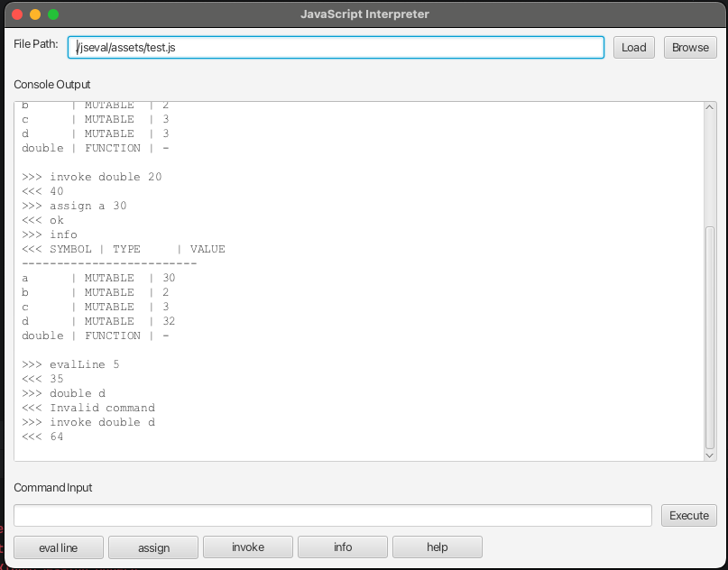

# Evaluator
An evaluator of a stripped down version of JS, aiming to replicate REPL of Node.js.
## Example Usage
 
## Supports:
- Declarations
- Function Declarations
  - Pure functions defined like:
  - ```js
    function double(x) {
      return x * 2;
    }
    ```
- Expressions
  - Arithmetic operations of +, -, *, /
  - Assignment
  - Function call expressions
  - Variable References
  - Literals (values)


## Tests:
Tests are contained in `src/test/` directory. The tests are:
- `EvalTests.kt` 
  - Tests core evaluation functionality
- `ParseTests.kt`
  - Tests core parsing functionality

## Commands
You can use the following commands in the interactive session:
- `info`: displays information about all the variables, their modifier types, and their values.
- `assign [varname] [varvalue]`:
  - assigns a variable to a value (NOTE: the variable should be declared first)
  - `varvalue` can also be an expression (e.g. `assign a c+4`)
- `evalLine [lineno]`: evaluates the given line number and returns the result if it is an expression
- `invoke [funcname] [args separated by comma]`: invokes a function with the given arguments and returns the result

## TODO
- Implement ``reload`` in program  -> move parser inside program
- Anonymous function expression (as arrow functions) implementation
  ```js
    const b = (c,d) => { ... }
    ```
- Implement support for ES named imports:
  ```js
    import { foo, bar } from "/modules/my-module.js";
    let x = 1 + foo;
    let y = 2 * bar;
    x + y
    ```

## Errors:
- `evalLine`: should return line number like files (including newlines etc.)
- check syntax errors:
  - `let a = d; \fjdf` should produce a syntax error but currently the parser ignores it 
  - `let a = c = 3` should produce a syntax error.
- assign request of not previously declared variable:
  - should I produce an error OR should I declare it as a new variable? (currently producing an error)
